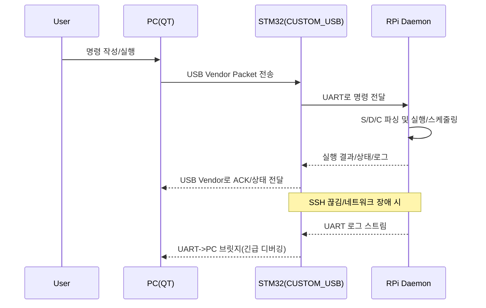
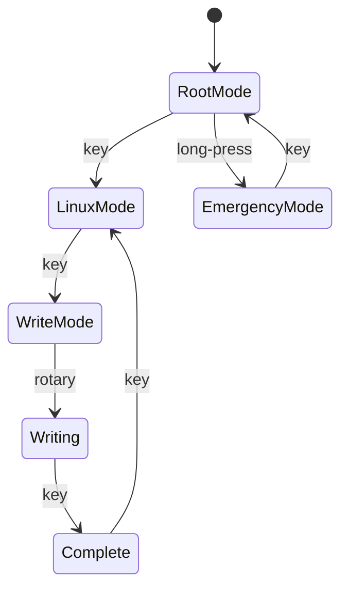

# CUSTOM_USB

***PC(QT)에서 TurtleBot(Raspberry Pi)를 USB 기반으로 제어/자동화하고, SSH/네트워크가 끊겨도 UART로 “긴급 통신(로그/쉘)”을 유지하는 커스텀 USB 브릿지 시스템***

<center>
  
</center>

---

## ✨ 한 줄 요약

**PC(QT) ↔ (USB Composite: Vendor + MSC + HID) ↔ STM32(Black Pill) ↔ (UART) ↔ Raspberry Pi(TurtleBot, Ubuntu Server)**  
구조로 **명령 전달 / 파일 교환 / 키 이벤트 입력 / 긴급 로그 브릿지**를 제공하는 프로젝트입니다.

---

## 🧩 배경 & 목표

- TurtleBot(Raspberry Pi) 제어를 PC에서 더 안정적이고 구조적으로 수행
- USB로 명령을 전달하고, Raspberry Pi의 daemon이 이를 파싱/실행하도록 구성
- SSH가 끊기거나 네트워크가 불안정해도 **UART를 통해 로그/쉘을 PC로 전달**하여 복구 가능
- 버튼/로터리 입력 등을 **HID(키보드)** 로 PC에 전달해 UI/제어를 단순화
- **MSC(USB Mass Storage)** 로 로그/스크립트/설정 파일을 교환하는 워크플로 지원(옵션)

---

## 🏛️ 시스템 아키텍처 (System Architecture)

```mermaid
flowchart LR
  PC[PC\nQT App] <-->|USB Composite\nVendor + MSC + HID| MCU[Black Pill / STM32\nCUSTOM_USB Firmware]
  MCU <-->|UART| RPI[Raspberry Pi\nUbuntu Server (TurtleBot)]
  RPI -->|exec| SYS[(Linux / ROS2 / TurtleBot)]
  RPI -->|logs| MCU -->|UART bridge| PC
```

---

## 🧱 구성 요소 (Components)

### 1) PC (QT App)
- **역할**: 사용자 UI 제공, 명령 작성/전송, 결과/로그 표시
- **통신**
  - **USB Vendor**: 구조화된 명령/응답/상태 처리
  - **MSC**: 파일 기반 워크플로(로그/스크립트/설정 교환 등)
  - **HID**: 버튼/로터리 등 입력을 키 이벤트로 수신(옵션)

### 2) STM32 / Black Pill (CUSTOM_USB Firmware)
- **역할**: USB Composite Device + UART 브릿지
- **USB 인터페이스**
  - **Vendor**: PC ↔ STM32 명령/상태 통신
  - **MSC (Mass Storage)**: 파일 교환 채널(옵션/확장)
  - **HID (Keyboard)**: 물리 입력을 PC 키 입력으로 전달(옵션)
- **UART 인터페이스**
  - 정상: RPi daemon으로 명령 전달 / 응답 수신
  - 비상: RPi 로그/쉘 스트림을 PC로 브릿지

### 3) Raspberry Pi (TurtleBot, Ubuntu Server) + daemon
- **역할**: UART로 들어온 명령을 파싱/실행/스케줄링하고 상태/로그를 반환
- **명령 분류**
  - `S` (Static): 즉시 실행 단발 명령 (예: `apt update`)
  - `D` (Delay): 지연이 필요한 명령 (예: “5m 이동 후 다음 단계”)
  - `C` (Continuous): bringup처럼 **백그라운드/지속 실행** 명령

---

## 🔁 작동 흐름 (Workflow)



---

## 🧾 명령 모델 (S / D / C)

daemon이 처리하는 명령은 3종으로 나뉩니다.

### S: Static (단발 실행)
- 예: `apt update`, `uname -a`, `ros2 topic list`

### D: Delay (지연/시간 기반)
- 예: “로봇 5m 이동 → n초 대기 → 다음 명령 실행”
- 구현 예시(문서용)
  - `D,<delay_ms>,<cmd>`
  - 또는 “timeout/스케줄러 큐” 기반

### C: Continuous (지속 실행/백그라운드)
- 예: `ros2 launch ... bringup` 처럼 계속 떠 있어야 하는 프로세스
- 권장 기능
  - PID/프로세스 추적
  - 중복 실행 방지
  - stop/restart/status(옵션)

> ⚠️ 실제 문자열/패킷 포맷은 레포 구현에 맞게 아래 “프로토콜” 섹션에 확정된 형태로 기록하세요.

---

## 🧭 디바이스 모드 (예: Linux / Emergency)

(버튼/로터리 입력으로 모드 전환 UX가 있다면 아래처럼 문서화하면 발표/인수인계가 편합니다.)



- **LinuxMode**: 정상 제어 모드(PC → Vendor → daemon 실행)
- **EmergencyMode**: SSH/네트워크 장애 시 UART 로그/쉘 확보 모드

---

## 🔌 통신 프로토콜 개요 (Protocol)

### 1) USB Vendor (PC ↔ STM32)
- 목적: 구조화된 명령/응답/상태를 안정적으로 전달
- 문서용 패킷 형태 예시
  - `TYPE` (S/D/C)
  - `ID` (명령 ID)
  - `LEN`
  - `PAYLOAD`
  - `CRC` (선택)

```text
[SOF][TYPE][ID][LEN][PAYLOAD...][CRC][EOF]
```

### 2) UART (STM32 ↔ Raspberry Pi)
- 목적: daemon으로 명령 전달 + 실행 결과/로그 수신
- Emergency 모드에서는 로그 스트림을 우선 브릿지

---

## 🧰 기술 스택 (Tech Stack)

### Firmware (STM32 / Black Pill)
- Language: C
- USB: TinyUSB (Composite: Vendor + MSC + HID)
- MCU: STM32 HAL/LL
- UART: Interrupt/DMA 기반(권장)

### PC Client (QT)
- Language: C++ / Qt
- 역할: 디바이스 탐색, Vendor 통신, 명령 UI, 로그 뷰어

### Raspberry Pi daemon
- Language: (레포 기준: Python/C++)
- 역할: 명령 파싱(S/D/C), 실행/스케줄링, 상태 보고, 로그 스트림

---

## 📦 레포 구조 (예시)

```text
CUSTOM_USB/
├─ firmware/                 # STM32 펌웨어
│  ├─ usb/                   # TinyUSB composite 설정
│  ├─ hid/                   # 키보드 이벤트/키맵
│  ├─ msc/                   # MSC (SD/가상 디스크)
│  └─ uart/                  # UART bridge
├─ pc_client_qt/             # PC용 QT 앱
├─ rpi_daemon/               # Raspberry Pi daemon
├─ docs/                     # 문서/설계/프로토콜 정의
└─ assets/                   # 이미지/gif/다이어그램
```

---

## 🚀 설치 및 실행 (Setup & Usage)

> 아래 명령은 예시입니다. 레포의 실제 빌드/실행 방식에 맞게 수정하세요.

### 1) STM32 펌웨어 빌드/플래시
```bash
cd firmware
# make / cmake / STM32CubeIDE 등 프로젝트 구성에 맞게
make
```

### 2) Raspberry Pi daemon 실행
```bash
cd rpi_daemon
./run.sh
# 또는
python3 main.py
```

(서비스로 운영한다면)
```bash
sudo systemctl enable custom_usb_daemon
sudo systemctl start custom_usb_daemon
```

### 3) PC(QT) 실행
```bash
cd pc_client_qt
./CUSTOM_USB_CLIENT
```

---

## 🧯 트러블슈팅 (Troubleshooting)

- **USB Composite가 정상적으로 안 잡힘 (Vendor/MSC/HID 일부만 뜸)**
  - 디스크립터/인터페이스 번호 충돌 확인
  - OS별 드라이버 바인딩 확인(특히 Windows)

- **Vendor 통신은 되는데 UART가 조용함**
  - STM32 UART TX/RX 교차 연결, baudrate, GND 공통 확인
  - RPi에서 `/dev/ttyAMA0` / `/dev/ttyS0` 혼동 주의

- **Emergency 모드에서도 로그가 안 올라옴**
  - RPi UART 콘솔/로그 출력 설정 확인
  - daemon이 UART를 독점하고 있지 않은지 확인

---

## 🗺️ 로드맵 (Roadmap)

- [ ] Vendor 프로토콜 표준화(ACK/재전송/타임아웃)
- [ ] C(continuous) 프로세스 관리 강화(stop/restart/status)
- [ ] 로그 채널 분리(명령 채널 vs 스트림 채널)
- [ ] docs 자동 생성(프로토콜/명령 명세)

---

## 📄 License
MIT (또는 프로젝트 정책에 맞게 변경)
