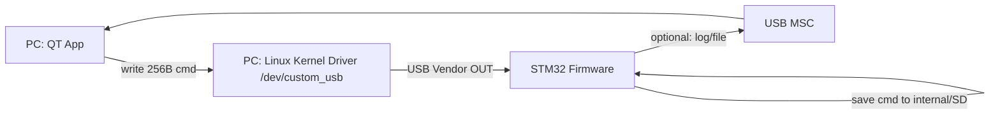
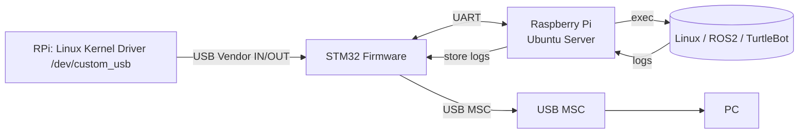

# CUSTOM_USB

***PC(QT)에서 TurtleBot(Raspberry Pi)를 USB 기반으로 제어/자동화하고, SSH/네트워크가 끊겨도 UART로 “긴급 통신(로그/쉘)”을 유지하는 커스텀 USB 브릿지 시스템***

<center>
  
</center>

---

## ✨ 한 줄 요약

**PC(QT) ↔ (Linux Kernel Driver) Vendor + UART(긴급) ↔ Black Pill(Tiny USB Composite: Vendor + MSC) ↔ Vendor + UART(긴급) ↔ Raspberry Pi(TurtleBot, Ubuntu Server) ↔ (Linux Kernel Driver) ↔ daemon**  
구조로 **명령 전달 / 로그·파일 교환 / 네트워크 장애 대비 UART 긴급 루트**를 제공하는 프로젝트입니다.

> 핵심 포인트: **Vendor로 들어온 “256B 명령 패킷”을 커널 드라이버가 읽고/쓰게 만들고**, QT/daemon은 `/dev/*` 디바이스 파일로 간단히 접근합니다.

---

## 🧩 배경 & 목표

- TurtleBot(Raspberry Pi) 제어를 PC에서 **더 안정적이고 구조적으로** 수행
- USB Vendor로 명령을 전달하고, Raspberry Pi의 daemon이 이를 파싱/실행하도록 구성
- SSH가 끊기거나 네트워크가 불안정해도 **UART로 로그/쉘을 PC로 브릿지**하여 복구 가능
- **MSC(USB Mass Storage)** 로 로그/스크립트/설정 파일을 교환하는 워크플로 지원(옵션)

---

## 🏛️ 시스템 아키텍처 (System Architecture)

CUSTOM_USB는 “한 번에 한 쪽에만 USB로 연결되는 STM32” 특성 때문에, 실사용 흐름을 **2단계**로 보는 게 이해가 쉽습니다.

### 1) PC 연결 단계 (명령 작성/저장)



### 2) Robot 연결 단계 (명령 실행/로그 회수)



---

## 🧱 구성 요소 (Components)

### 1) PC (QT App)
- **역할**
  - 사용자 UI 제공 (명령 작성/컴파일/큐 관리)
  - 명령(256B struct)을 **Vendor로 전송**
  - 실행 결과/로그 표시(옵션: MSC로 파일 회수)
- **통신**
  - **USB Vendor**: 구조화된 명령/응답/상태 처리
  - **MSC**: 로그/스크립트/설정 파일 교환 등

### 2) STM32 / Black Pill (CUSTOM_USB Firmware)
- **역할**: USB Composite Device + UART 브릿지 + 명령 저장/전달
- **USB**
  - **Vendor**: PC/RPi ↔ STM32 명령 패킷 전송(256B)
  - **MSC**: 로그/파일 교환(옵션)
- **UART**
  - 정상: RPi daemon으로 명령 전달 / 응답 수신
  - 비상: RPi 로그/쉘 스트림을 PC로 브릿지(구현 시)

### 3) Raspberry Pi (TurtleBot, Ubuntu Server) + daemon
- **역할**
  - `/dev/custom_usb`를 통해 STM32로부터 명령 패킷을 읽어 실행
  - 명령을 `S/D/C`로 분류하여 실행/스케줄링
  - 필요 시 로그를 STM32(또는 파일)로 저장해 회수 가능하게 처리
- **명령 분류**
  - `S` (Static): 즉시 실행 단발 명령 (예: `apt update`)
  - `D` (Delay): 지연이 필요한 명령 (예: “5m 이동 후 다음 단계”)
  - `C` (Continuous): bringup처럼 **백그라운드/지속 실행** 명령

### 4) Linux Kernel Driver (PC/RPi 공용)
- **왜 필요한가?**
  - Vendor endpoint로 들어오는 “데이터 뭉치(명령 패킷)”를 **유저 공간(QT/daemon)이 안정적으로 read/write** 하기 위해
  - libusb로 직접 다뤄도 되지만, 커널 드라이버로 만들면:
    - QT/daemon이 **파일 I/O(`read/write/poll`)** 로 단순해짐
    - 연결/해제, 동시성, 버퍼링을 커널에서 일관되게 관리 가능

- **역할**
  - USB 디바이스(VID/PID, 인터페이스)를 `probe()`로 잡고 Vendor 인터페이스를 claim
  - Bulk/Interrupt endpoint를 사용해 **URB 송수신**
  - 수신 패킷을 커널 링버퍼에 적재 → 유저 공간에서 `read()` 가능
  - 유저 공간 `write()`는 송신 큐를 통해 endpoint로 전송
  - `poll()`/`select()` 지원으로 이벤트 기반 처리(QT UI, daemon loop) 가능
  - 연결 해제 시 `disconnect()`에서 안전하게 정리

- **유저 공간 인터페이스 예시**
  - `/dev/custom_usb0` (char device)
  - `read(fd, buf, 256)` : STM32→Host(명령/상태/응답)
  - `write(fd, buf, 256)` : Host→STM32(명령 패킷)
  - (선택) `ioctl()` : 현재 모드/에러 코드/버퍼 상태 조회 등

---

## 🔁 작동 흐름 (Workflow)


---

## 🧾 명령 모델 (S / D / C)

daemon이 처리하는 명령은 3종으로 나뉩니다.

### S: Static (단발 실행)
- 예: `apt update`, `uname -a`, `ros2 topic list`

### D: Delay (지연/시간 기반)
- 예: “로봇 5m 이동 → n초 대기 → 다음 명령 실행”
- 구현 예시(문서용)
  - `D,<delay_ms>,<cmd>`
  - 또는 “timeout/스케줄러 큐” 기반

### C: Continuous (지속 실행/백그라운드)
- 예: `ros2 launch ... bringup` 처럼 계속 떠 있어야 하는 프로세스
- 권장 기능
  - PID/프로세스 추적
  - 중복 실행 방지
  - stop/restart/status(옵션)

---

## 🧭 디바이스 모드 (Linux / Emergency)


- **LinuxMode**: 정상 제어 모드(PC/RPi → Vendor → daemon 실행)
- **EmergencyMode**: SSH/네트워크 장애 시 UART 쉘 확보 모드(구현 시)

---

## 🔌 통신 프로토콜 (USB Vendor)

### 패킷 크기: 256 bytes

- 목적: 구조화된 명령/응답/상태를 안정적으로 전달
- 기본 컨셉: **커널 드라이버가 256B 프레임 단위로 read/write** 하도록 고정

#### 레이아웃(문서 기준)

```text
0x00  (4)    magic          = 0xDEADBEEF
0x04  (1)    info_id        = bit-fields (명령 타입/플래그 등)
0x05  (2)    cmd_len        = 실제 문자열 길이 (0~249)
0x07  (249)  cmd_statement  (ASCII/UTF-8, NULL-optional)
총 256 bytes
```

#### C struct 예시(참고)

```c
#pragma pack(push, 1)
typedef struct {
    uint32_t magic;        // 0xDEADBEEF (LE)
    uint8_t  info_id;      // bit-fields
    uint16_t cmd_len;      // 0~249
    char     cmd[249];     // command string
} vendor_pkt_t;
#pragma pack(pop)
```

> 팁: magic/길이 검증을 **커널 드라이버에서 1차로** 하면, 유저 공간에서 예외 처리가 훨씬 단순해집니다.

---

## 🔌 UART (STM32 ↔ Raspberry Pi)

- 목적: daemon으로 명령 전달 + 실행 결과/로그 수신
- Emergency 모드에서는 로그 스트림을 우선 브릿지(구현 시)
- 권장: UART는 **프레이밍(길이/헤더/CRC)** 을 두거나 라인 기반으로 최소한의 동기화 수단을 두는 편이 안정적입니다.

---

## 🧰 기술 스택 (Tech Stack)

### Firmware (STM32 / Black Pill)
- Language: C
- USB: TinyUSB (Composite: Vendor + MSC)
- MCU: STM32 HAL/LL
- UART: Interrupt/DMA 기반(권장)

### Linux Kernel Driver (PC/RPi)
- Language: C (Linux Kernel Module)
- USB: `usb_driver`, URB(Bulk/Interrupt)
- Interface: char device(`/dev/custom_usb*`), `read/write/poll`, (optional) `ioctl`

### PC Client (QT)
- Language: C++ / Qt
- 역할: 디바이스 파일(`/dev/custom_usb*`) I/O, 명령 UI, 로그 뷰어

### Raspberry Pi daemon
- Language: (레포 기준: Python/C++)
- 역할: 명령 파싱(S/D/C), 실행/스케줄링, 상태 보고, 로그 저장/회수

---

## 📦 레포 구조 (예시)

```text
CUSTOM_USB/
├─ firmware/                 # STM32 펌웨어
│  ├─ usb/                   # TinyUSB composite 설정
│  ├─ msc/                   # MSC (SD/가상 디스크)
│  └─ uart/                  # UART bridge
├─ kernel_driver/            # Linux kernel module (PC/RPi 공용)
├─ pc_client_qt/             # PC용 QT 앱
├─ rpi_daemon/               # Raspberry Pi daemon
├─ docs/                     # 문서/설계/프로토콜 정의
└─ assets/                   # 이미지/gif/다이어그램
```

---

## 🚀 설치 및 실행 (Setup & Usage)

> 아래 명령은 예시입니다. 레포의 실제 빌드/실행 방식에 맞게 수정하세요.

### 1) STM32 펌웨어 빌드/플래시
```bash
cd firmware
make
```

### 2) 커널 드라이버 빌드/로드 (PC/RPi 공용)
```bash
cd kernel_driver
make
sudo insmod custom_usb.ko
dmesg | tail
ls -l /dev/custom_usb*
```

(권한 설정 예: udev rule)
```bash
# /etc/udev/rules.d/99-custom-usb.rules
KERNEL=="custom_usb*", MODE="0666"
```

### 3) Raspberry Pi daemon 실행
```bash
cd rpi_daemon
./run.sh
# 또는
python3 main.py
```

### 4) PC(QT) 실행
```bash
cd pc_client_qt
./CUSTOM_USB_CLIENT
```

---

## 🧯 트러블슈팅 (Troubleshooting)

### 1) STM32에서 보내준 명령어가 커널 영역에서 read가 안 되는 상황
- **증상**: `read()`가 블록되거나, 드라이버가 프레임을 버림
- **주요 원인**
  - magic 값이 다름 → 검증 로직에서 drop
  - endian/struct packing 불일치(특히 `cmd_len`, `magic`)
  - host가 256B를 “부분 write” 해서 프레임 경계가 깨짐
- **해결 팁**
  - 커널에서 256B 단위로만 enqueue/dequeue 하도록 강제
  - `#pragma pack(1)` / `__attribute__((packed))` 사용
  - `cmd_len <= 249` 범위 체크, NULL 종료 정책 통일

### 2) SDIO 통신이 잘 안 되는 상황(MSC/SD 관련)
- **원인/경험**
  - 기본 세팅에서 SDIO 환경 바꾸기보다는 **main에서 별도 SDIO 설정**을 명시하는 편이 안정적
- **체크리스트**
  - 클럭/버스폭/풀업, DMA 설정, 카드 타입(SDHC) 호환 확인

### 3) USB Composite가 정상적으로 안 잡힘(Vendor/MSC 일부만 뜸)
- 디스크립터/인터페이스 번호 충돌 확인
- OS별 드라이버 바인딩 확인(특히 Linux에서 자동 바인딩되는 클래스 드라이버)

### 4) Vendor 통신은 되는데 UART가 조용함
- STM32 UART TX/RX 교차 연결, baudrate, GND 공통 확인
- RPi에서 `/dev/ttyAMA0` / `/dev/ttyS0` 혼동 주의

### 5) Emergency 모드에서도 로그가 안 올라옴
- RPi UART 콘솔/로그 출력 설정 확인
- daemon이 UART를 독점하고 있지 않은지 확인

---

## 🗺️ 로드맵 (Roadmap)

- [ ] Vendor 프로토콜 표준화(ACK/재전송/타임아웃)
- [ ] 커널 드라이버 ioctl 확장(버퍼 상태/에러코드/모드 조회)
- [ ] C(continuous) 프로세스 관리 강화(stop/restart/status)
- [ ] 로그 채널 분리(명령 채널 vs 스트림 채널)
- [ ] docs 자동 생성(프로토콜/명령 명세)

---

## 📄 License
MIT (또는 프로젝트 정책에 맞게 변경)
